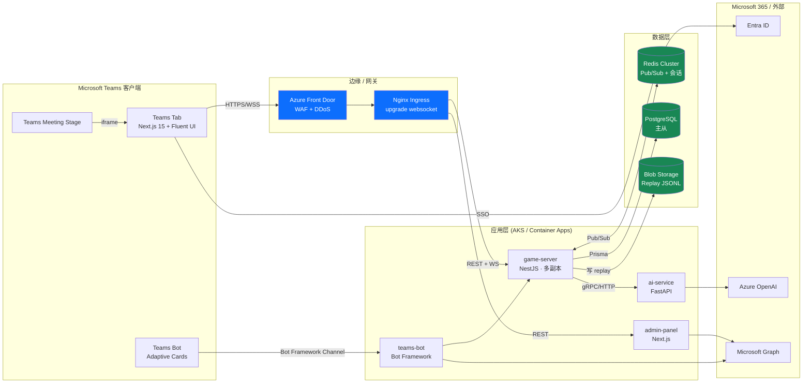
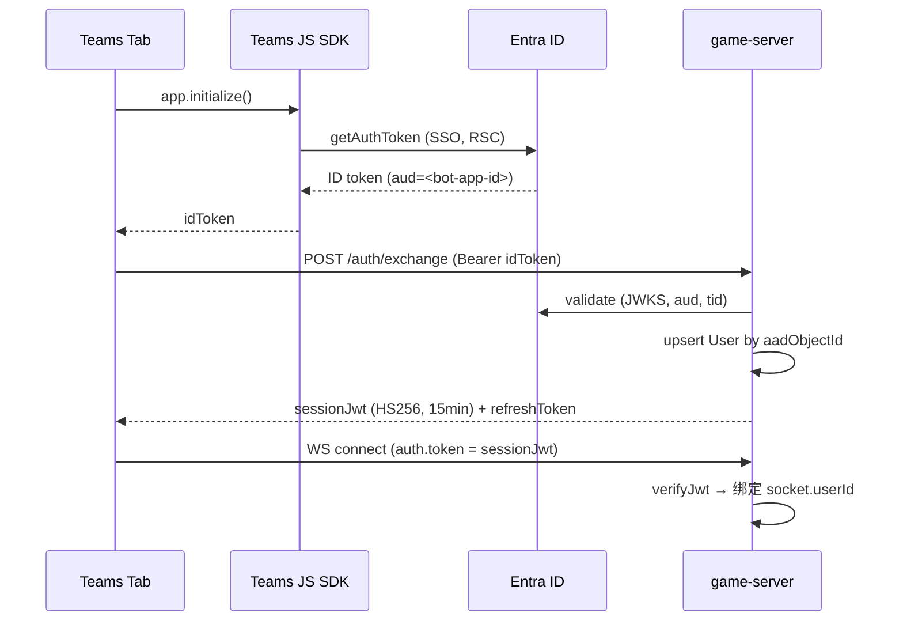
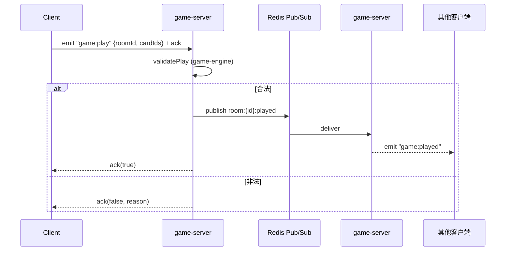
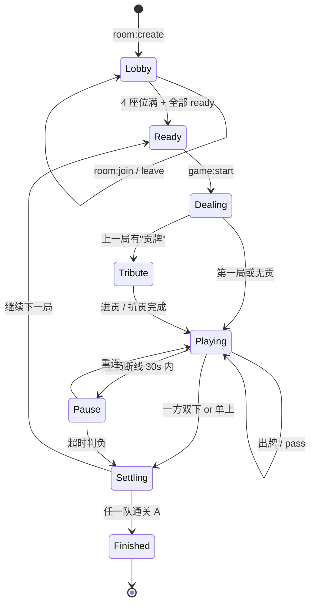
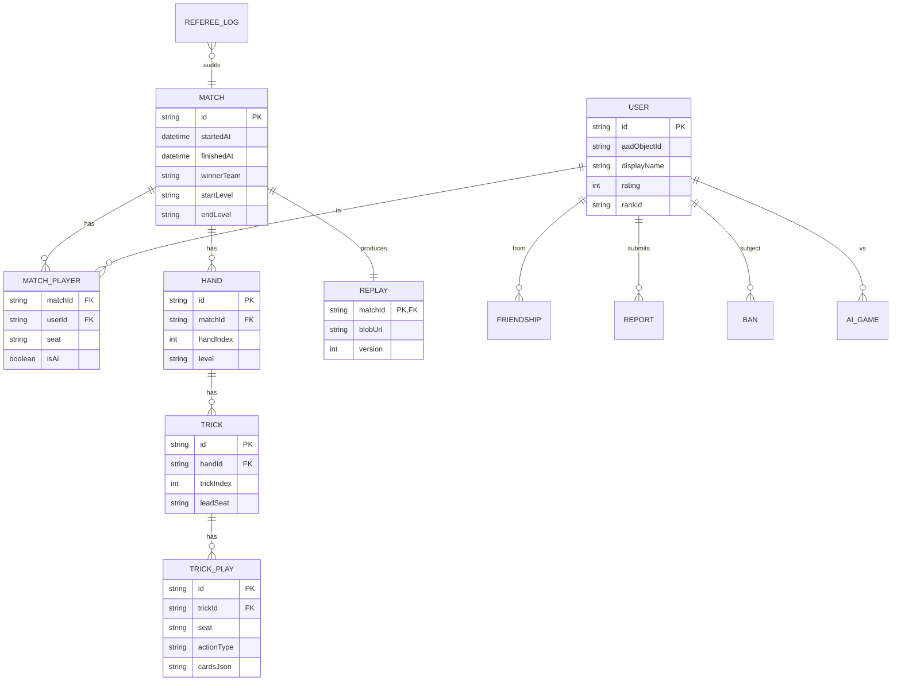
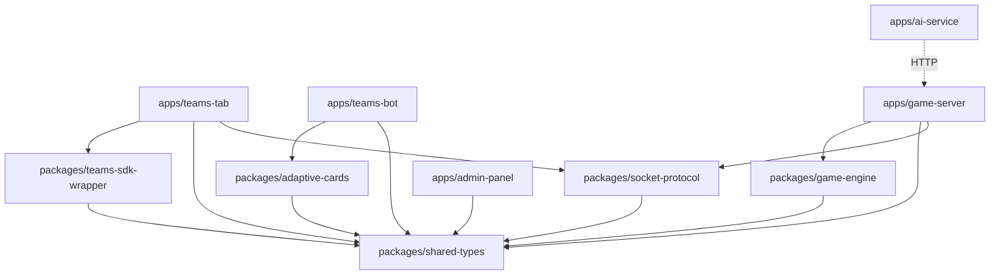
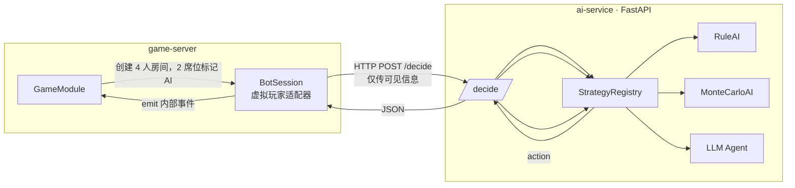
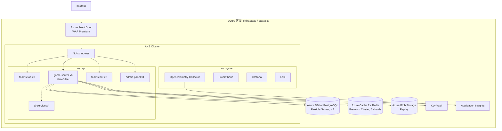
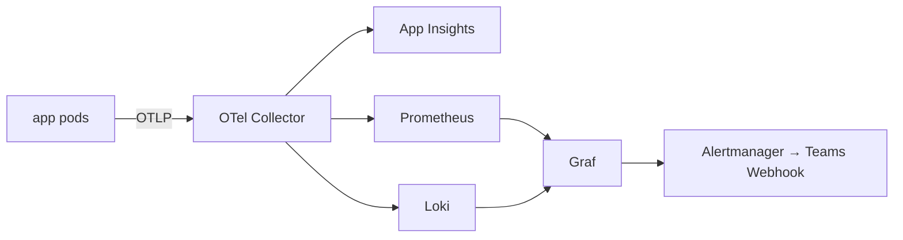
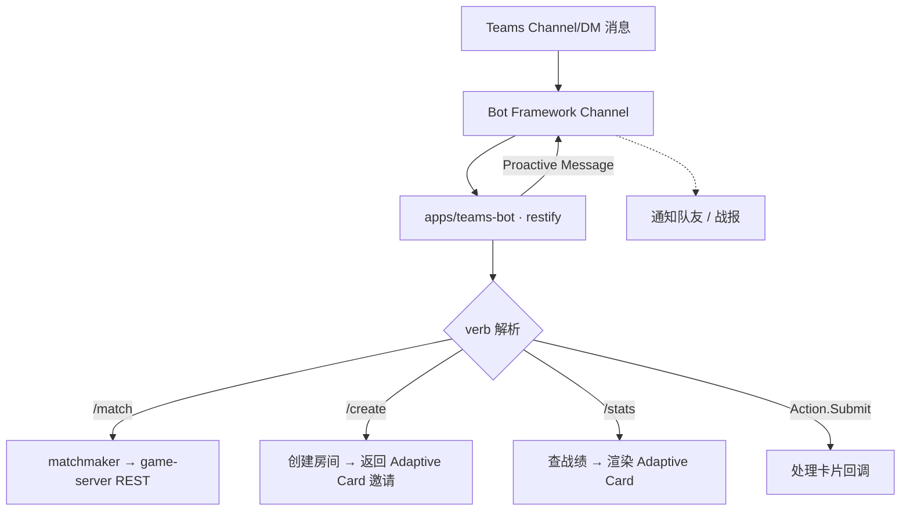

# 01 · 系统架构

> **Architect Agent 产物 · v1.0** — 覆盖 Phase 1 ~ Phase 4 的目标态。Phase 1（MVP）实际落地范围在文末"渐进式落地"一节。

---

## 0. 设计原则

| # | 原则 | 落地要求 |
|---|---|---|
| 1 | **权威服务端** | 一切牌、随机数、合法性判断在 game-server；客户端只显示与发送意图 |
| 2 | **无状态 Web 层 + 有状态对战层** | API/Tab 可任意横向扩展；对战在 Redis 集群里固化"房间→节点"的粘性 |
| 3 | **协议显式化** | Socket 事件类型在 `packages/socket-protocol` 共享，前后端共用 TS 类型 |
| 4 | **AI = 普通玩家** | AI 通过相同 Socket 协议接入（不绕过规则引擎），只是 transport 不同 |
| 5 | **Teams 是渠道** | 业务核心独立于 Teams，可在浏览器/Electron 复用 |
| 6 | **可观测性内建** | 每个 Socket 事件、每一手出牌都进入 OpenTelemetry trace |

---

## 1. 整体架构



---

## 2. 仓库 → 进程 → 容器映射

| 仓库 package / app | 进程 | 容器 (k8s Pod) | 副本策略 |
|---|---|---|---|
| `apps/teams-tab` | `next start :3000` | `teams-tab` | 无状态，HPA by CPU |
| `apps/game-server` | `node dist/main.js` (NestJS) | `game-server` | **粘性会话**，HPA by 并发连接数 |
| `apps/teams-bot` | `node dist/index.js` | `teams-bot` | 无状态，2 副本起 |
| `apps/admin-panel` | `next start :3002` | `admin-panel` | 无状态，1-2 副本 |
| `apps/ai-service` | `uvicorn app.main:app` | `ai-service` | 无状态，HPA by 队列深度 |
| `packages/*` | （npm/pnpm workspace 共享库） | — | — |

---

## 3. 鉴权方案



- **Token 类型**：第三方接入用 Entra ID（OIDC），WebSocket 持续会话用自签 JWT（短 TTL + 长 refresh）。
- **作用域分层**：`user` / `referee` / `admin`，写入 JWT claims，Nest 的 `RolesGuard` 校验。
- **Bot 鉴权**：Bot Framework 自带 channel auth，Bot → game-server 单独走 service-to-service JWT。

---

## 4. WebSocket 消息流



**关键约定**：
- 所有 client→server 事件 **必须 ack**（Socket.IO 内置）；超时 5s 视为失败。
- 服务端广播事件 **不依赖 ack**，依赖客户端 reconnect + snapshot 复原。
- 跨节点广播一律走 Redis `@socket.io/redis-adapter`，**禁止直连节点**。
- 出牌带 `seq` 字段（房间内自增），服务端校验是否等于 `lastSeq + 1`，否则拒绝（幂等 + 防重放）。

事件列表见 [03-socket-protocol.md](./03-socket-protocol.md) 与 `packages/socket-protocol/src/events.ts`。

---

## 5. 房间状态机



实现于 `apps/game-server/src/room/`（Phase 1），状态机用 XState 或纯函数表 + Nest service 实现均可。

---

## 6. 游戏状态同步

**两种视图共存**：

1. **私有视图 (`game:state`)** — 仅发给"自己"的 snapshot，含手牌明细、合法出牌提示。
2. **公共视图 (`game:public`)** — 发给同房间所有玩家与观战者，含已出牌、剩余张数、计时。

**同步触发点**：
- 任意 `game:play` / `game:pass` 后；
- 客户端重连握手时（拉一次全量 snapshot 替代回放）；
- 服务端切节点 / 房间迁移后。

**snapshot 内容（要点）**：
```ts
{
  roomId, phase, level, currentSeat,
  trickTop: { seat, cards, kind }, // 桌面顶手
  seats: { N: { handCount, isAuto, isOffline, lastAction }, ... },
  myHand?: Card[],                 // 仅私有视图
  hint?: Card[][],                 // 合法出牌建议（私有）
  trickHistory: { seat, cards }[], // 本轮历史
  seq, serverTime
}
```

---

## 7. Redis 使用方案

| Key 模式 | 类型 | 用途 | TTL |
|---|---|---|---|
| `socket.io#/game#<room>` | hashes/sets | Socket.IO Adapter 内部 | 由 adapter 管理 |
| `sess:<userId>` | string (JWT id) | 会话→节点粘性 | 24h |
| `room:<roomId>` | hash | 房间元数据（玩家、座位、级牌） | 6h（无活动） |
| `room:<roomId>:state` | string (JSON) | 完整对局快照（断线重连复原） | 6h |
| `room:<roomId>:lock` | string | 防止并发出牌（SET NX PX 2000） | 2s |
| `match:queue:<rating-bucket>` | list | 匹配队列 | 5min |
| `rate:<userId>:play` | string + EXPIRE | 限流（每 200ms 一次出牌） | 1s |
| **频道** `room:<id>:bus` | Pub/Sub | 跨节点房间事件广播 | — |
| **频道** `system:bus` | Pub/Sub | 全局公告、强制下线 | — |

> **关键**：所有"对房间的写"必须先 `SET NX` 抢锁；释放用 Lua 校验 token，避免误删别人的锁。

---

## 8. 数据库 ER（草案）



完整 schema 见 [06-database.md](./06-database.md) 与 `apps/game-server/prisma/schema.prisma`。

---

## 9. 模块依赖图



> 约束：所有箭头**单向**，禁止 packages → apps；禁止 apps 互相依赖（必须通过网络协议）。

---

## 10. AI Bot 接入



**反作弊规则**：`/decide` payload 由 game-server 拼装，**只包含 AI 自己的手牌、桌面顶手、桌面历史、级牌**。AI 服务无任何数据库读权限。

---

## 11. 反作弊

| 风险 | 对策 |
|---|---|
| 客户端伪造出牌 | game-engine `validatePlay` 必须在服务端跑；客户端的提示仅供 UX |
| 重放/连点 | 每个 client→server 事件带 `seq`；Redis 限流 200ms/出牌 |
| 多端同账号 | `sess:<userId>` 互斥，新登录踢旧 socket |
| 观战者透视手牌 | 私有视图 `myHand` 仅按 `socket.userId === seat.userId` 下发 |
| 共谋（同 IP / 同设备） | 进 admin 风控队列；同 IP 4 人组队触发审核 |
| AI 服务被劫持 | `/decide` 走内网 + mTLS；payload 不含其它三家手牌 |

---

## 12. 部署拓扑（生产）



**容量基线（Phase 3 目标）**：
- 并发对局 **10 000**（4 人/局 = 40 000 并发 socket）
- game-server 单 Pod：~3 000 socket、~500 active rooms（2 CPU / 4Gi）
- Redis：~50k ops/s（Pub/Sub + 读写）
- Postgres：写入 ~200 TPS（每手出牌不直接落库，批量异步写）

---

## 13. 横向扩展策略

| 维度 | 策略 |
|---|---|
| **无状态层** (Tab/Bot/Admin/AI) | HPA by CPU + 请求 P95 |
| **game-server** | StatefulSet + 按 `roomId` 一致性哈希到 Pod；新增 Pod 触发 Redis 中"未来房间"重路由，**已有房间不迁移**（迁移=保存 snapshot→断开→新节点恢复，需 Phase 3 实现） |
| **Redis** | Cluster 6 分片起步；分片键以 `room:<id>` 为基准 |
| **Postgres** | 主写 + 1-2 只读副本；战绩/排行榜走只读 |
| **回放** | 增量写 Blob，按 `match/{yyyy}/{mm}/{dd}/{matchId}.jsonl` |

---

## 14. 日志 / 监控 / 告警



**SLO**：
- WS 握手成功率 ≥ 99.9%（5min 窗口）
- 出牌 ack P95 < 150 ms（用户↔最近 AKS 节点）
- 房间状态写入丢失率 = 0（任何写都先写 Redis snapshot）

**关键指标**：
- `room_active_total`、`socket_connected_total`、`play_validation_fail_total`、`reconnect_within_30s_ratio`、`ai_decide_latency_ms`、`prisma_query_p95`。

---

## 15. Teams App Manifest 设计

`apps/teams-tab/appPackage/manifest.json` 已就位（v1.17）。生产版需追加：

- `bots[]` — Bot Framework App ID + scope `team` `groupchat` `personal`
- `composeExtensions[]` — 消息扩展，输入 `掼蛋 @user1 @user2 @user3` 创建房间
- `staticTabs[]` — 增加 "战绩" / "回放" / "排行榜"
- `configurableTabs[]` — Channel/Group 级"掼蛋大厅"
- `webApplicationInfo` — Entra ID App ID + resource (`api://<domain>/<botAppId>`)
- `authorization.permissions.resourceSpecific[]` — RSC 权限（读 channel 成员）
- `meetingExtensionDefinition` — Phase 3 接入会议观战

---

## 16. Microsoft Graph 集成

| 场景 | 调用 | 权限 |
|---|---|---|
| 显示真名/头像 | `GET /me`、`GET /users/{id}/photo/$value` | `User.Read` |
| 群聊"叫上 @张三" | `GET /chats/{id}/members` | `ChatMember.Read.Chat` (RSC) |
| 战报推到 Teams Activity Feed | `POST /teams/{teamId}/sendActivityNotification` | `TeamsActivity.Send` |
| 公告/赛事通知 | `POST /chats/{id}/messages` | `ChatMessage.Send.Chat` (RSC) |

---

## 17. Teams Bot Framework 设计



**命令规范**（discoverable）：
- `/help` — 列命令
- `/match` — 加入匹配
- `/create [private|public]` — 建房并发送邀请卡
- `/join <roomId>` — 加入房间
- `/stats [@user]` — 战绩
- `/leaderboard` — 排行榜

---

## 18. API 网关

无独立 gateway 进程，由 Nginx Ingress 承担：

```
/                → teams-tab
/admin           → admin-panel
/api/*           → game-server (REST)
/socket.io/*     → game-server (WS, sticky cookie io)
/bot/*           → teams-bot (Bot Framework endpoint)
/.well-known/*   → teams-tab (静态)
```

- **粘性**：基于 `Set-Cookie: io` 与 `ip_hash` 双保险，保证同一 socket 升级路径同一 Pod。
- **限流**：`limit_req_zone $binary_remote_addr zone=api:10m rate=100r/s`；登录端点单独 5r/s。

---

## 19. 目录结构（约束）

```
apps/
  teams-tab/        ← Next.js App Router, 不直接 import packages/game-engine
  teams-bot/        ← restify + botbuilder, 调 game-server REST
  game-server/      ← NestJS, 唯一拥有 game-engine + Prisma
  admin-panel/      ← Next.js, 只读为主
  ai-service/       ← FastAPI, 唯一暴露 /decide
packages/
  game-engine/      ← 纯函数, 无 IO, 无 Nest
  shared-types/     ← 跨语言的 DTO（zod schema 后续可加）
  socket-protocol/  ← 仅类型 + 常量
  adaptive-cards/   ← 卡片 JSON 模板
  teams-sdk-wrapper/← 隔离 @microsoft/teams-js, 便于 mock
infrastructure/
  docker/  bicep/  terraform/
docs/
```

---

## 20. 渐进式落地

| Phase | 必交付能力 | 不做 |
|---|---|---|
| **0 (✅)** | Monorepo 骨架、CI、本地能起 game-server | 任何业务逻辑 |
| **1 (MVP)** | 登录、创建/加入房间、4 人对局、规则引擎闭环、Phase 4 结算、断线 30s 重连、简易 UI | 观战、AI、回放、排行榜 |
| **2** | AI Bot（3 难度）、战绩、排行榜、Adaptive Card 战报、好友 | 跨节点房间迁移、赛事 |
| **3** | 回放（Blob+前端 player）、观战、裁判、Meeting Stage 接入、跨节点扩缩容 | 国际化、商业化 |
| **4** | 赛事系统、公会、AI 解说、AppSource 上架 | — |

---

## 21. 关键扩展性建议

1. **协议版本号** — `socket-protocol` 暴露 `PROTOCOL_VERSION`，握手时不匹配则强制升级客户端，防"老 Tab 残留"。
2. **房间-节点亲和** — Phase 3 把"房间路由表"从 Redis 升级为 [Hash slot + Lease]（Etcd 或 Redis RedLock），避免 Pod 漂移时房间死锁。
3. **规则引擎纯函数** — 严禁在 `packages/game-engine` 内引入任何带状态的依赖（log/db/clock），便于 1) 单测 2) 跨语言重写（Rust/Wasm 用于 AI 加速）。
4. **AI 多策略热插拔** — `ai-service` 用 `STRATEGY_REGISTRY` 动态注册，Bicep 参数控制启停某策略，无需重新打镜像。
5. **Replay = 事件溯源** — `TRICK_PLAY` 表实质是 event log；回放仅按时间重放事件，状态推导走 game-engine，绝不持久化中间状态。
6. **Teams 渠道隔离** — `teams-tab` 与浏览器普通页共用代码，所有 Teams 专属 API 经 `teams-sdk-wrapper` 隔离，便于做 Electron / Steam 版本。

---

## 22. 高并发优化清单

- [ ] Socket.IO 升级到 `transports: ['websocket']`，跳过 polling（除非 corp proxy 需要回退）。
- [ ] `binary: false`，所有 payload JSON；牌 ID 用 8-bit 整数 (`0..107`) 压缩。
- [ ] Nest Gateway 用 `useFactory` 注入 Redis Adapter；启用 `parser: msgpack`（Phase 2）。
- [ ] Prisma 启 `previewFeatures = ["driverAdapters"]` + pgBouncer transaction 模式。
- [ ] AI `/decide` 设 `concurrency=4` per worker + LRU cache（按 `hash(hand|top|level)`）。
- [ ] 出牌广播 batch：100ms 窗口内同房间多事件合并为一条 `game:state` diff。
- [ ] 静态资源走 Front Door CDN；Adaptive Card JSON 预编译为常量。

---

## 附录 A · 状态机伪代码（核心循环）

```ts
// apps/game-server/src/game/turn.service.ts (Phase 1 草案)
class TurnService {
  async onPlay(roomId: string, userId: string, cardIds: string[]) {
    const lock = await this.redis.acquire(`room:${roomId}:lock`, 2000);
    try {
      const state = await this.rooms.snapshot(roomId);
      assert(state.currentSeat === seatOf(state, userId), 'NOT_YOUR_TURN');

      const cards = mapById(state.hands[state.currentSeat], cardIds);
      const result = validatePlay(cards, {
        hand: state.hands[state.currentSeat],
        currentTrickTop: state.trickTop,
        level: state.level,
      });
      if (!result.ok) throw new BadRequestException(result.reason);

      const next = applyPlay(state, cards);
      await this.rooms.commit(roomId, next);          // 写 Redis snapshot
      await this.replays.append(roomId, { seat, cards, ts: now() });
      this.bus.publish(`room:${roomId}:bus`, { type: 'played', seat, cards });

      if (next.phase === 'settling') this.scheduler.scheduleNextHand(roomId);
    } finally {
      await lock.release();
    }
  }
}
```

---

**文档版本**：v1.0 · 2026-05-28 · Architect Agent  
**Review 状态**：草案；Rules / Socket / DB Agent 实现时若发现冲突，以子文档修订为准并回写本文件 § 对应小节。
