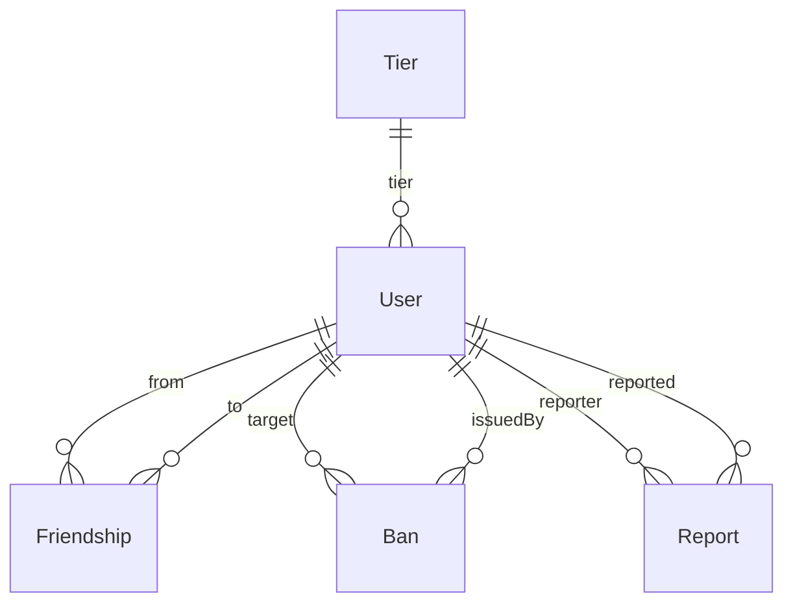
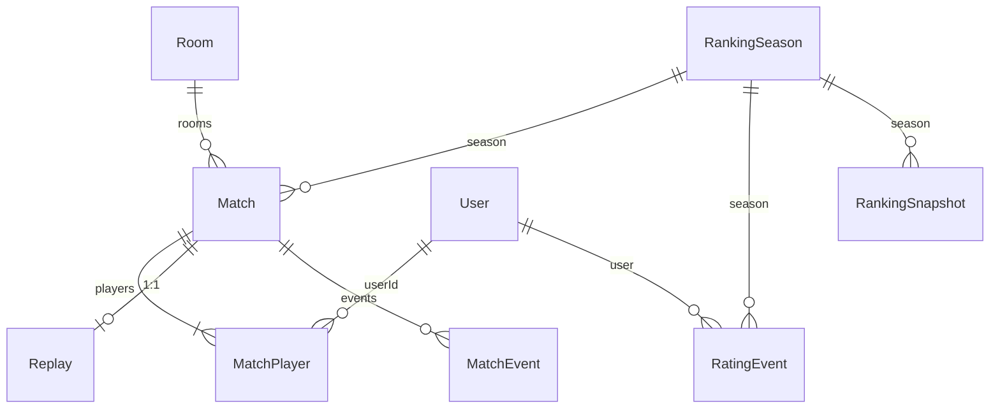
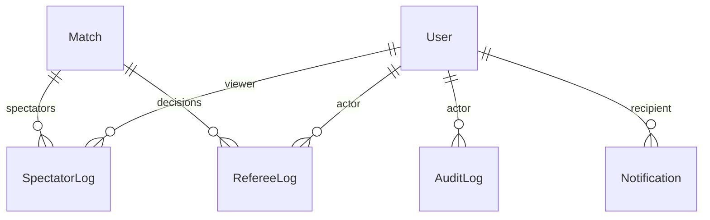

# 06 · Database Agent

> Source of truth: [`apps/game-server/prisma/schema.prisma`](../apps/game-server/prisma/schema.prisma)（17 models + 13 enums，已通过 `prisma validate`）。

## §1 设计原则

1. **OLTP 与事件流分离**：核心实体（User / Room / Match / Tier / Season）使用 CUID 主键；高吞吐事件表（`MatchEvent` / `RatingEvent` / `SpectatorLog` / `RefereeLog` / `AuditLog` / `Notification`）使用 `BigInt @id @default(autoincrement())`，便于 `pg_partman` 按月分区与列存归档。
2. **Bot 与人类账户统一建模**：`User.kind = HUMAN | BOT`，使 `MatchPlayer.userId` 非空、所有外键统一，避免 `nullable userId` 带来的索引退化与统计偏差。
3. **聚合字段允许冗余**：`User.rating`、`Match.hasAiPlayers` 是从事件源/明细派生的缓存列，写路径由应用层维护，读路径直接命中索引。
4. **回放 = DB 元数据 + Blob JSONL**：`Replay` 行只存路径 / 大小 / schema 版本；事件流以 gzip JSONL 写入 Azure Blob，DB 只保留近期热数据（`MatchEvent`）用于回看 / 反作弊。
5. **运行时状态走 Redis**：房间座位 / 当前回合 / 在线名单等高频可变状态 **不** 落库（详见 §3）；DB 只在对局结束时落 `Match`/`MatchPlayer`/`RatingEvent`。
6. **审计可重放**：所有破坏性操作经 `AuditLog`；段位变化经 `RatingEvent`（事件源）+ `RankingSnapshot`（物化视图）双写。

## §2 ER 图（按域分组）

### 2.1 用户域



### 2.2 对局域



### 2.3 观战 / 裁判 / 审计



## §3 Redis 缓存方案

| Key 模式 | 类型 | TTL | 说明 |
| --- | --- | --- | --- |
| `room:{roomId}` | HASH | 6h（idle） | 房间静态信息镜像（host / level / phase） |
| `room:{roomId}:members` | HASH `seat -> userId` | 跟随房间 | 四个座位的当前占用 |
| `room:{roomId}:online` | SET | 心跳 30s | 当前实际在线（含观战） |
| `room:{roomId}:turn` | HASH | 跟随房间 | `currentSeat / lastPlay / passCount / deadline` |
| `user:{userId}:session` | STRING (JWT/Teams ctx) | 24h | SSO 上下文 |
| `user:{userId}:room` | STRING | 跟随房间 | sticky session，断线重连必查 |
| `leaderboard:{seasonId}` | ZSET（score=rating） | 5 min 刷新 | 来自 `RankingSnapshot`，热点 top-100 在内存 |
| `lobby:rooms` | ZSET（score=createdAt） | 实时 | `phase=WAITING` 房间列表 |
| `match:{matchId}:events` | STREAM | 对局结束后归档 | 实时事件 fan-out，归档为 JSONL → Blob |

**Pub/Sub 频道**：

- `room:{roomId}:events` — 跨节点广播 socket 消息（Socket.IO Redis Adapter）。
- `referee:{tenantId}` — 裁判事件实时推送至管理后台。
- `notif:{userId}` — 个人通知。

## §4 分表 / 分区策略

| 表 | 策略 | 工具 |
| --- | --- | --- |
| `match_events` | 月分区（`at`） | `pg_partman` |
| `audit_logs` | 月分区（`at`） | `pg_partman` |
| `notifications` | 月分区（`createdAt`），已读后 30 天清除 | `pg_partman` + `pg_cron` |
| `rating_events` | 季度分区（`at`） | `pg_partman` |
| `spectator_logs` | 月分区（`enteredAt`） | `pg_partman` |
| `matches` | 暂不分区，到 5,000 万行后按 `startedAt` 季度分区 | — |

**冷归档**：6 个月以上的分区 `DETACH` + `COPY` 到 Azure Blob（Parquet），用 Synapse / DuckDB 离线查询。

## §5 Replay 存储

- **存储位置**：Azure Blob，路径 `replays/{yyyy}/{mm}/{matchId}.jsonl.gz`。
- **格式**：每行一个 JSON 事件，schema 由 `Replay.schemaVer` 标注，初版字段：
  ```json
  {"seq":42,"at":"2025-01-12T10:23:00Z","seat":2,"kind":"PLAY","payload":{"cards":["H7","S7"],"category":"PAIR"}}
  ```
- **DB 行（`Replay`）**：`{ matchId, blobUrl, sizeBytes, schemaVer, expiresAt }`，与 `Match.replayId` 互为 `@unique`。
- **保留策略**：CASUAL 90 天、RANKED 1 年、TOURNAMENT 永久。过期由后台任务删 Blob 并保留 DB 元数据。
- **热点回看**：最近 7 天的 `MatchEvent` 留在 DB 供反作弊 / 投诉处理直接 SQL 查询。

## §6 高频查询与索引

| 场景 | 查询 | 命中索引 |
| --- | --- | --- |
| 我的最近 20 场 | `match_players where userId=? order by matchId desc limit 20` + join `matches` | `match_players_pk(matchId,userId)` + `matches[startedAt DESC]` |
| 房间大厅 | `rooms where phase='WAITING' order by createdAt desc` | `rooms[phase, createdAt DESC]` |
| 赛季 Top100 | Redis `ZREVRANGE leaderboard:{seasonId} 0 99`；fallback `ranking_snapshots[seasonId, rank]` | `ranking_snapshots[seasonId, rank]` |
| 段位榜 | `users where tierId=? order by rating desc limit 50` | `users[tierId, rating DESC]` |
| 举报队列 | `reports where status='OPEN' order by createdAt asc` | `reports[status, createdAt]` |
| 裁判操作回看 | `referee_logs where matchId=? order by seq` | `referee_logs[matchId, seq]` |
| AI 训练样本 | `matches where kind='AI_TRAINING' and finishedAt > ?` | `matches[kind, result, finishedAt]` |
| 反作弊事件回放 | `match_events where matchId=? order by seq` | `match_events[matchId, seq]` UNIQUE |
| 个人段位变化 | `rating_events where userId=? order by at desc limit 20` | `rating_events[userId, at DESC]` |
| 通知未读数 | `notifications where userId=? and readAt is null` | `notifications[userId, readAt]` |

## §7 审计 / 数据保留

- **写路径**：所有“管理动作”（封禁 / 解封 / 强制结束对局 / 修改段位 / 删除用户）必须先写 `AuditLog` 再执行业务，并带 `actorId / targetType / targetId / diff`。
- **不可变性**：`AuditLog` 表只 INSERT，应用层无 UPDATE/DELETE；DBA 通过分区 `DETACH` 实现归档。
- **保留**：审计 7 年、对局元数据 5 年、回放按 §5、运行日志 30 天。
- **GDPR / 企业租户离场**：`tenantId` 索引 + 软删除（`User.status='DELETED'` + 匿名化 `displayName`、保留 `tenantId` 供赛事统计）。

## §8 已知限制 / Phase 2 TODO

- [ ] `RoomMember` 快照表（房间内成员变化全程留痕，目前只在 Redis）。
- [ ] 赛事 / 公会域：`Tournament` / `Bracket` / `Club` / `ClubMember`。
- [ ] 跨租户分片键（当前 `tenantId` 仅作为索引列）。
- [ ] `MatchEvent.payload` 走 JSONB —— 待加入 GIN 索引 + 字段约束。
- [ ] 读写分离：应用层目前没有 replica 路由，后续 Prisma 拓扑加 `directUrl` + 读库代理。
- [ ] 与 `apps/game-server` 的代码集线：当前 Phase 1 不实例化 Prisma Client，等 Phase 2 接入排行榜 / 战绩时再编写 Repository 层。

## §9 验证

```pwsh
cd apps/game-server
pnpm exec prisma format
pnpm exec prisma validate
# => "The schema at prisma\schema.prisma is valid 🚀"
```
