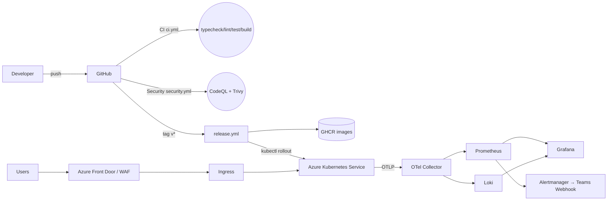

# 07 · DevOps Agent

> 目标：让本仓库一条命令跑起来（本地），一次推送上线（生产）。覆盖容器化 / CI/CD / 灰度发布 / 监控告警 / 安全。

## §1 全景图



## §2 容器化

| App | Dockerfile | 基础镜像 | 端口 |
| --- | --- | --- | --- |
| game-server | `apps/game-server/Dockerfile` | `node:22-alpine` multi-stage | 3001 |
| teams-tab   | `apps/teams-tab/Dockerfile`   | `node:22-alpine` + Next standalone | 3000 |
| ai-service  | `apps/ai-service/Dockerfile`  | `python:3.12-slim` | 8000 |

- `pnpm fetch / install --frozen-lockfile` + BuildKit cache mount，最快二次构建 < 30s。
- Non-root 用户、`HEALTHCHECK`、`provenance` + SBOM 由 `docker/build-push-action@v6` 生成。

## §3 本地一键栈

```pwsh
# 仅核心服务
docker compose up -d --build

# 含监控（Prometheus / Grafana / Loki / OTel Collector）
docker compose --profile obs up -d --build

# Grafana http://localhost:3002（anonymous viewer，admin/admin）
# Prometheus http://localhost:9090，Loki :3100，OTLP :4317/4318
```

Compose 默认走 `nginx` 边车做 `/socket.io/ + /api/ + /` 路由，与生产 Ingress 行为一致。

## §4 Kubernetes / AKS

清单见 [`infrastructure/k8s/`](../infrastructure/k8s)：

- `game-server` Deployment（3 副本起步，HPA 至 20，PDB minAvailable=2，RollingUpdate maxUnavailable=0）。
- Service `sessionAffinity: ClientIP` + Ingress `upstream-hash-by: $binary_remote_addr`：让 Socket.IO 长连接尽量回到原 Pod；跨节点广播由 Redis Adapter 兜底。
- `teams-tab` 2 副本；`ai-service` 2 副本（CPU 重，配 2 vCPU/2Gi limit）。
- 生产强烈建议 PG/Redis 用 **Azure Database for PostgreSQL Flexible Server (HA)** 与 **Azure Cache for Redis (Cluster)**，仓内 `30-stateful.yaml` 仅作演示。
- Secret 用 **External Secrets Operator** 或 **Azure Key Vault CSI** 注入。

## §5 CI/CD

| Workflow | 触发 | 作用 |
| --- | --- | --- |
| `.github/workflows/ci.yml` | push / PR → main | `pnpm typecheck / lint / test / build` + `ruff / pytest` |
| `.github/workflows/security.yml` | push / PR / 周一 04:00 | CodeQL（TS + Python） + Trivy 文件扫描 |
| `.github/workflows/release.yml` | tag `v*.*.*` 或手动 | 矩阵构建 3 镜像 → GHCR → `kubectl set image` 滚动升级 |

### 灰度 / 蓝绿建议

短期：`release.yml` 单环境 `rollout`（maxUnavailable=0，自动回滚靠 `rollout status` 失败）。

中期：接入 **Argo Rollouts**：
1. 5% 流量到 canary 5 分钟；
2. Prometheus 指标查询（错误率 < 1%、p95 < 300ms）；
3. 自动渐进 25 → 50 → 100，失败自动 abort + 回滚。

## §6 监控告警

- **Metrics**：Node SDK 用 `@opentelemetry/sdk-node` + `otlp-http` 推送到 `otel-collector:4318`，Collector 用 `prometheus` exporter 暴露给 Prometheus 拉取。
- **Logs**：应用 `pino` JSON 输出 → stdout，由 Promtail / OTel `filelog` 接 Loki。
- **Traces**：所有跨服务调用（HTTP / Socket.IO event / FastAPI）注入 `traceparent`，落到 Collector → Tempo（生产）/ debug exporter（本地）。
- **关键 SLI**：
  - socket P95 RTT ≤ 80 ms
  - 房间创建成功率 ≥ 99.9 %
  - 出牌请求错误率 < 0.1 %
  - AI 决策时间 P95 < 1 s（与 §6 prompts 对齐）
- **告警通道**：Alertmanager → Teams Incoming Webhook（沿用 Teams 生态）。

## §7 安全

- **WAF**：Azure Front Door + WAF Standard（OWASP 3.2 规则集），开启速率限制 100 req/min/IP。
- **DDoS**：Azure DDoS Protection Standard（VNet 级）。
- **镜像扫描**：Trivy（仓内） + GHCR + Defender for Containers。
- **SBOM / provenance**：`build-push-action` 输出 SPDX SBOM 与 SLSA Provenance attestation。
- **Secrets**：禁止入仓；CI 用 OIDC（`azure/login@v2` 无长效密码）；运行时 Key Vault CSI。
- **Teams 鉴权**：Entra ID SSO，token 仅在服务端校验；socket 握手必带 `auth.token`，server 端通过 Microsoft Graph 校验后下发短期会话 token。

## §8 发布流程（Teams App Manifest）

1. 修改 `apps/teams-tab/manifest/manifest.json` 版本号 → PR。
2. 合并后打 tag `vX.Y.Z` → `release.yml` 构建镜像 + 滚动升级 AKS。
3. `pnpm --filter teams-tab manifest:zip` 产出 `appPackage.zip`（待补 npm script）。
4. **Teams Admin Center → 自定义应用上传**（企业内灰度），或 **Partner Center → AppSource** 提交审核。
5. 审核期间用 Activity Feed 通知预览用户。

## §9 已知 / Phase 2 TODO

- [ ] Argo Rollouts canary + Prometheus analysis template。
- [ ] `Tempo` traces backend（当前 Collector debug exporter）。
- [ ] `kube-prometheus-stack` / `loki-stack` Helm values 入仓。
- [ ] `apps/teams-tab/manifest/` 与 `npm script manifest:zip`。
- [ ] Bicep / Terraform 拉齐：AKS + PG Flexible + Redis + Front Door + Key Vault + Storage（replay）。
- [ ] 备份策略：PG `pgbackrest` + Blob versioning；季度灾难演练。
