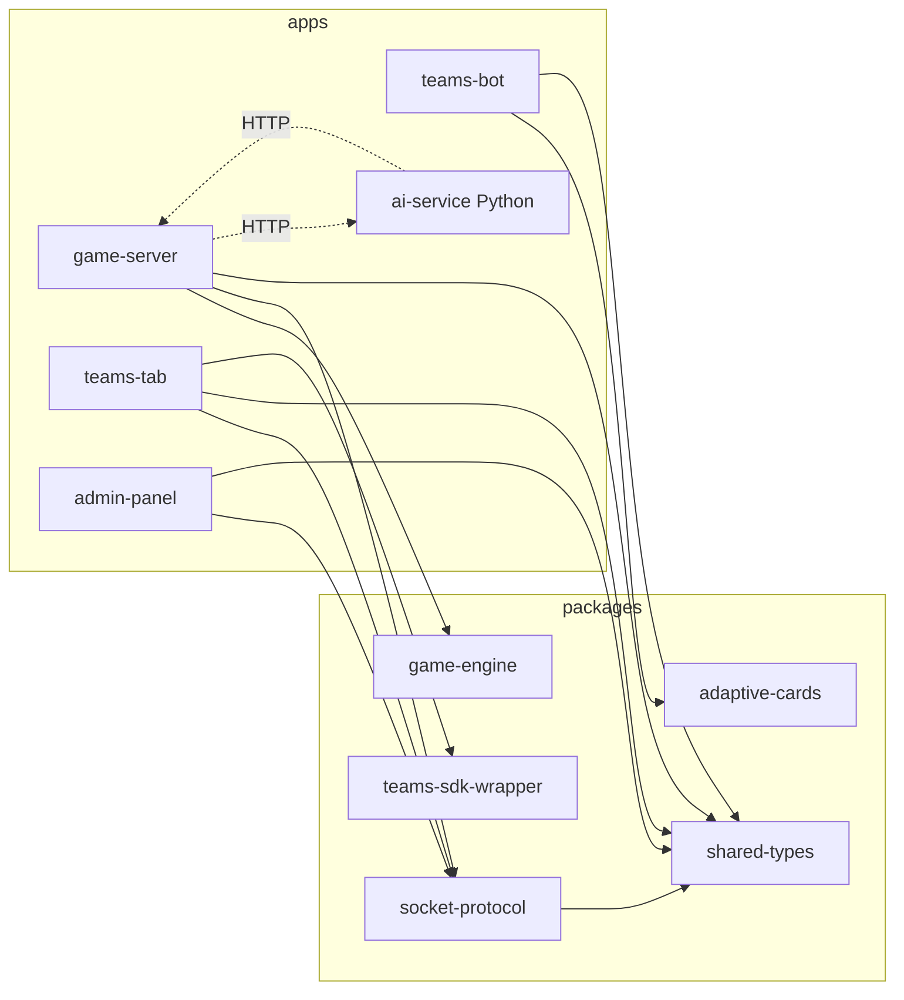
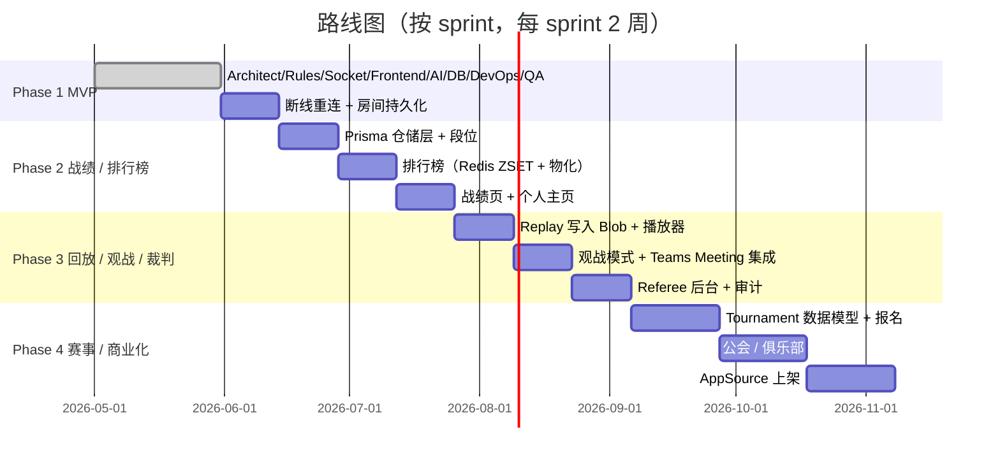

# 09 · Master Orchestrator

> 整个 Teams 掼蛋项目的"总指挥": 把九位 Agent 的产物拼成一个能演进的工程体系。本文档负责 **目录 / 模块依赖 / 节奏 / 看板**；规范细节在 [10-conventions.md](./10-conventions.md)。

## §1 目录全景

```
teams-guandan/
├── apps/
│   ├── teams-tab/            # Next.js 15 + Fluent UI（玩家入口）
│   ├── teams-bot/            # Bot Framework Adapter（群命令 / Adaptive Card）
│   ├── game-server/          # NestJS + Socket.IO + Prisma（实时对战核心）
│   ├── admin-panel/          # Next.js 管理 / 裁判后台（Phase 3+）
│   └── ai-service/           # Python FastAPI（AI 评估 / LLM Agent，独立部署）
├── packages/
│   ├── game-engine/          # 纯函数规则引擎（55 测试）
│   ├── shared-types/         # 跨服务领域类型
│   ├── socket-protocol/      # WebSocket 事件 + payload 契约
│   ├── adaptive-cards/       # Teams Adaptive Card JSON 模板
│   └── teams-sdk-wrapper/    # @microsoft/teams-js 适配层
├── infrastructure/
│   ├── docker/               # Compose + nginx + Prometheus/Grafana/Loki/OTel 配置
│   ├── k8s/                  # K8s manifests（namespace/deploy/HPA/PDB/ingress）
│   ├── bicep/, terraform/    # IaC（占位，Phase 2 完善）
│   └── azure/                # AppSource / 发布说明
├── tests/
│   ├── e2e/                  # Playwright
│   ├── load/                 # Node 自研压测
│   └── mock/                 # Microsoft Graph mock
├── docs/                     # 01-09 + prompts
├── .github/                  # workflows + CODEOWNERS + PR 模板
├── package.json, pnpm-workspace.yaml, tsconfig.base.json
└── docker-compose.yml
```

## §2 模块依赖图



依赖规则（强约束，由 PR 评审守护）：

1. **`apps/*` 不允许互相 import**——跨 app 通信必须通过 `socket-protocol` 或 HTTP。
2. **`packages/*` 不允许 import `apps/*`**——可被 apps 依赖，反之不行。
3. `game-engine` 不依赖任何其他 package（保持纯，便于 AI/客户端复用）。
4. `socket-protocol` 仅依赖 `shared-types`；不依赖 NestJS / React。
5. Python `ai-service` 与 Node 域之间走 HTTP/JSON，不共享代码（Phase 2 用 OpenAPI 自动生成 client）。

## §3 Agent ↔ 产物 对照

| Agent | 主要产物 | 文档 |
| --- | --- | --- |
| Architect | 22 节架构 + 10 Mermaid | [01-architecture.md](./01-architecture.md) |
| Rules | `packages/game-engine`（55 测试） | [02-rules-engine.md](./02-rules-engine.md) |
| Socket | `apps/game-server` 网关 + `packages/socket-protocol` | [03-socket-protocol.md](./03-socket-protocol.md) |
| Frontend | `apps/teams-tab`（Next 15 + Fluent UI + Zustand） | [04-frontend.md](./04-frontend.md) |
| AI Bot | `apps/game-server/src/ai/`（3 难度 + bot 调度） | [05-ai-bot.md](./05-ai-bot.md) |
| Database | `apps/game-server/prisma/schema.prisma`（17 models） | [06-database.md](./06-database.md) |
| DevOps | Dockerfile×3 / compose / k8s / workflows | [07-devops.md](./07-devops.md) |
| QA | vitest + Playwright + load + mock（78 + 2） | [08-qa.md](./08-qa.md) |
| Master | 本文 + [10-conventions.md](./10-conventions.md) | — |

## §4 Phase 路线图



## §5 当前 Sprint 看板（Phase 2 · Sprint 2）

| Lane | Owner | 状态 |
| --- | --- | --- |
| ~~MatchRepository 接口 + InMemory 实现~~ | Database | ✅ Done (Sprint 1) |
| ~~RatingService (ELO K=24)~~ | AI/Server | ✅ Done (Sprint 1) |
| ~~MatchService 接入 game:start/finished~~ | Server | ✅ Done (Sprint 1) |
| ~~REST 战绩 / 排行榜 / 用户 API~~ | Server | ✅ Done (Sprint 1) |
| ~~teams-tab /profile + /leaderboard 页面~~ | Frontend | ✅ Done (Sprint 1) |
| `PrismaMatchRepository`（异步孪生 `AsyncMatchRepository` + DTO 转换 + `MATCH_MODULE` 按 `DATABASE_URL` 条件绑定，默认仍走 InMemory 不破现有测试） | Database | ✅ Done |
| ~~Prisma Client Module + 迁移脚本 + seed~~ | Database | ✅ Done (`PrismaService` 生命周期托管 + 全局 `PrismaModule.forRoot()` 按 `DATABASE_URL` 条件启停；baseline 迁移 `20260605000000_baseline` 由 `prisma migrate diff` 生成；`prisma/seed.ts` 幂等填充 4 HUMAN + 4 BOT + 演示 Match + RatingEvent；`prisma:seed` / `prisma:migrate:deploy` scripts) |
| ~~Tier 段位计算（按 rating 投影到 `tiers` 表）~~ | Server | ✅ Done |
| ~~战绩翻页 / 时间筛选~~ | Frontend | ✅ Done |
| ~~RatingEvent 评分流水（事件溯源）~~ | Server | ✅ Done |
| ~~Redis ZSET 排行榜（读路径）~~ | DevOps/Server | ✅ Done (InMemory ZSET，接口对齐 Redis；ioredis 替换即可) |
| ~~集成测试：完整对局落 Postgres~~ | QA | ✅ Done (`FakePrismaClient` 内存替身实现 PrismaClient 的 user/match/matchPlayer/ratingEvent + `$transaction` 子集，按行语义模拟；`prisma.match.integration.test.ts` 5 测试驱动完整对局：开局 → 收官 → 评分流水 → 累计统计 → leaderboard / cursor 翻页 / since-until / 不存在 match / BOT 排除。真实 Postgres 由 docker-compose e2e 补充) |

#### Phase 3 提前启动（外部依赖暂无，先做接口/内存版）

| Lane | Owner | 状态 |
| --- | --- | --- |
| ~~Replay 事件日志（内存版）+ REST `/api/v1/matches/:id/replay`~~ | Replay/Server | ✅ Done (接口对齐未来 Postgres `match_events` 表) |
| ~~Replay 播放器 UI（teams-tab）~~ | Frontend | ✅ Done (`/replay/[id]` 步进/自动播放/速度切换 + Profile 行内"回放"入口) |
| ~~观战模式（spectator socket room）~~ | Spectator/Server | ✅ Done (RoomService 观战状态 + `spectate:join` / `spectate:leave` + 断线清理) |
| ~~Referee 后台基础（裁判操作审计）~~ | Referee/Server | ✅ Done (RefereeService 角色注册 + 审计日志 + REST `/api/v1/referee/{roles,actions}`) |

#### Phase 3 · Sprint 2 看板（裁判 / 观战实战联动）

| Lane | Owner | 状态 |
| --- | --- | --- |
| ~~Referee Gateway 联动 (`referee:kick` / `referee:force_end`)~~ | Referee/Server | ✅ Done (RoomService kick/forceEnd + Gateway 广播 `room:kicked` / `game:aborted` / `referee:action`) |
| 观战入口 UI（teams-tab Spectate 按钮 + 公开视图） | Frontend | ✅ Done (Lobby 增加"观战"按钮 + 新路由 `/spectate/[id]`：`SpectatorTable` 复用牌桌布局 + 仅显示公开 lastPlay + `spectate:leave` 退出) |
| Spectator socket e2e 测试 | QA | ✅ Done (`socket.spectator.e2e.test.ts`：host + 3 bots + spectator 一局；断言 spectator 收到 `room:updated` / `game:played` / `game:passed` 但不接收 `game:state`，`spectate:leave` 后停止接收) |
| Referee admin-panel 审计页 | Frontend | ✅ Done (`apps/admin-panel/app/referee/page.tsx`：裁判角色管理 + 审计日志过滤（roomId / 裁判 / 目标 / kind / limit）+ Fluent 简表 + 颜色化 kind；`src/lib/api.ts` 封装 `NEXT_PUBLIC_GAME_SERVER_URL` + apiGet/apiSend；首页加 `/referee` 入口) |
| Referee 实时事件（warn / mute / unmute 广播） | Referee/Server | ✅ Done (RoomService mute/unmute 状态 + Gateway `referee:warn` / `referee:mute` / `referee:unmute` 三命令；isMuted 网关侧拦截钩子已就位待 Phase 4 聊天接入) |

### 历史 Sprint 简记

- **Sprint 1 (Phase 2)** — 战绩 + 排行榜 MVP（内存仓储），见 [00-overview.md 当前进度](./00-overview.md)。

#### Phase 3 · Sprint 3 看板（持久化 / 观战增强 / AI 调优）

| Lane | Owner | 状态 |
| --- | --- | --- |
| ~~Replay JSONL 文件持久化（无 DB 依赖）~~ | Replay/Server | ✅ Done (`replay.store.ts`：`ReplayStore` 接口 + `InMemoryReplayStore` + `JsonlReplayStore`（append-only `.jsonl` per matchId，路径白名单防注入）；ReplayService 通过 DI 注入 store（默认内存）；`ReplayModule` 工厂按 `REPLAY_DIR` env 切换；finishedAtMs 派生自首次 match_finish。+10 测试) |
| AI 难度调优（困难档：基础牌型估值 + 队友信号） | AI/Server | ✅ 完成（topOwnerSeat 透传 + hard 模式三项升级：起手 sizeBonusFactor 0.25 鼓励多牌组合、队友持顶 + 队友手少 + 对手安全则让位 pass、队友 ≤3 张不浪费炸） |
| Adaptive Card 渲染快照测试 | QA | ✅ Done (`packages/adaptive-cards/src/builders.ts`：新增 `buildWelcomeCard` / `buildRoomCreatedCard` / `buildMatchFinishedCard` / `buildRefereeActionCard` 四个带 TS 类型的 builder + `cards.test.ts`：17 测试（含 9 个 snapshot，覆盖 6 种 referee kind 的容器 style 变体）；加 vitest devDep + `test` script) |
| Spectator Teams Meeting Extension（占位 + manifest） | Frontend | ✅ Done（`packages/teams-sdk-wrapper/src/meeting.ts`：`buildSpectatorConfig` / `buildMeetingConfigurableTab` 纯函数 + `setSpectatorConfig` / `getMeetingContext` Teams SDK 包装；`apps/teams-tab/app/meeting/{configure,spectate}/page.tsx` 两个占位页（configure 提供 roomId 校验 + `pages.config.setConfig`；spectate landing 读取 meeting context）；`appPackage/manifest.json` 新增 meeting configurableTab（scope groupchat + context meetingSidePanel/Stage/ChatTab）；teams-sdk-wrapper 加 vitest + 8 测试（含 2 snapshot + manifest 契约校验）） |
| RatingEvent Postgres model + 迁移 | Database | ✅ Done (schema `RatingEvent` + baseline 迁移 + `PrismaMatchRepository.createRatingEvent/listRatingEventsByUser` + `FakePrismaClient` 集成测试覆盖 RatingEvent 流水) |

#### Phase 4 · Sprint 1 看板（赛事系统 启航）

| Lane | Owner | 状态 |
| --- | --- | --- |
| Tournament 数据模型 + 报名（schema + InMemory 仓储） | Database/Server | ✅ Done (`schema.prisma` 新增 `Tournament` / `TournamentEntry` / `TournamentRound` + 3 个枚举 + User 双向关系；`prisma/migrations/20260606000000_tournament/migration.sql` 手写 DDL；`apps/game-server/src/tournament/`：`TournamentRepository` 接口 + `InMemoryTournamentRepository`（队长唯一性 + maxTeams 容量校验 + 状态迁移自动 stamp startedAt/finishedAt）+ `TournamentModule` 接入 AppModule；+8 测试) |
| Tournament REST API（CRUD + 报名 + 提交） | Server | ✅ Done（service + controller + 16 tests / 282 green） |
| Bracket 单淘汰配对算法（seed 排序 + bye 处理） | Server | ✅ Done (`apps/game-server/src/tournament/bracket.ts`：纯函数 `generateSingleEliminationBracket(entries)` → 全轮次预生成 Bracket；`standardSeedOrder(2^N)` 递归构造（1 号种子和 2 号种子在不同半区）；非 2 的幂次报名按"补齐到下一 2 的幂次"原则给顶部 seed 派 bye，bye 侧自动 `preDeterminedWinner`；seed 缺失/重复时按 registeredAt 兜底；后续轮次用 `winner_of: matchId` 占位等待回填。+11 测试) |
| Tournament 报名 UI（admin-panel 创建 + teams-tab 报名） | Frontend | ✅ Done（admin-panel `/tournaments` 列表 + 创建表单（name/host/format/maxTeams/startLevel）+ 状态筛选；`/tournaments/[id]` 详情页（基本信息 + 生命周期按钮 open/close/start/finish/cancel + 报名队伍表 + entry 操作 confirm/withdraw/kick）。teams-tab `/tournaments` 大厅页（只显示 OPEN 赛事卡片）+ `/tournaments/[id]` 报名页（自动用 auth.userId 作为 captain + 队名/可选队友 + 容量/状态校验 + 我的报名展示 + 退赛）。两个 home page 加导航。typecheck 9/9 green，两个 Next.js 应用 build 成功。） |
| Guild / 公会 数据模型 | Database | ✅ Done（Prisma Guild + GuildMembership + 2 enums + 迁移；InMemoryGuildRepository（name/tag 唯一、容量校验）；GuildService（OWNER/ADMIN/MEMBER RBAC + APPROVAL/OPEN/INVITE_ONLY 三种入会策略 + request/invite/approve/kick/leave/promote/disband 全生命周期 + Owner 保护）；REST `/api/v1/guilds` & `/api/v1/guild-memberships`；GuildModule 接入 AppModule；18 service tests / 312 green） |
| PrismaTournamentRepository（异步孪生 + FakePrismaClient 扩展） | Database/Server | ✅ Done（`prisma.tournament.repository.ts`：AsyncTournamentRepository 接口 + Prisma 实现，P2002→duplicate captain/round 错误映射，RUNNING/FINISHED/CANCELLED 自动 stamp 时间戳；FakePrismaClient 新增 tournament/tournamentEntry/tournamentRound 三张表 + 唯一性模拟；+11 集成测试 / 293 green） |
| AppSource 上架准备清单（manifest 审核 / 隐私声明） | DevOps | ✅ Done（`docs/11-appsource-submission.md`：8 节清单 — 资产清单 / Manifest 审核 / 合规与安全审查 / 隐私声明骨架 / 服务条款骨架 / Smoke Test 流程 / 提交 Run Book / Sign-off 模板，含具体规格（icon 192/32px、screenshot 1366×768、validDomains 清理、AAD SSO `webApplicationInfo`、Publisher Attestation 选项）与三方签字门控） |

#### Phase 4 · Sprint 2 看板（赛事/公会 异步化 & 推进）

| Lane | Owner | 状态 |
| --- | --- | --- |
| PrismaGuildRepository（异步孪生 + FakePrismaClient 扩展） | Database/Server | ✅ Done（`apps/game-server/src/guild/prisma.guild.repository.ts`：`AsyncGuildRepository` 接口 + Prisma 实现，P2002 → DUPLICATE_NAME / DUPLICATE_TAG / DUPLICATE_MEMBER 语义化错误映射，`updateMembership` 状态 → LEFT/KICKED 自动 stamp `leftAt`，`updateGuild` 支持 `disbandedAt` patch；FakePrismaClient 扩展 `guild` + `guildMembership` 表 mock（含 name/tag 唯一约束 + nullable tag 允许多 NULL 行为）；+14 集成测试 / 326 green） |
| Bracket 推进 API（record match result → advance bracket） | Server | ✅ Done（`apps/game-server/src/tournament/bracket.ts`：`BracketMatch.winner` 字段 + 纯函数 `propagateBracket` / `recordBracketResult` / `findBracketMatch` / `getBracketChampion` + `BracketProgressError`（4 个 code）；`TournamentService.getLiveBracket` / `recordBracketMatchResult` / `getBracketMatch`，运行中 bracket 状态以 `liveBrackets` Map 缓存；最终 match 决出后自动 `FINISHED` 赛事并返回 champion；`startTournament` 自动 propagate round-1 byes 到下游 slot。新 REST：`GET /api/v1/tournaments/:id/live-bracket` / `GET .../matches/:matchId` / `POST .../result`，BracketProgressError → 400/404/409 状态码映射；+20 测试（11 bracket 纯函数 + 9 service 集成）/ 346 green） |
| Tournament 自动开局调度 | Server | ⏳ Todo |
| GDPR DSR `/admin/v1/users/:aad/erase` | Server/Security | ✅ Done（`apps/game-server/src/admin/`：`UserPiiSink` 端口接口（anonymizeUser/anonymizeTeamEntries/anonymizeGuildMemberships）+ `InMemoryUserPiiSink` 参考实现（FNV-1a `shortHash` 生成确定性 pseudonym `[erased:xxxxxxxx]` / `Team-xxxxxxxx`）；`EraseService` 串联三类 PII 子系统，幂等（重复 erase 命中 `already_erased`），每次请求追加 `ErasureRecord` 审计；`EraseError` 三态（USER_NOT_FOUND 404 / BAD_REQUEST 400）；REST `POST /api/v1/admin/users/:userId/erase`（body `{requestedBy, reason}`）+ `GET /api/v1/admin/erase-log?userId=`；AdminModule 接入 AppModule；+11 测试 / 357 green） |
| Guild 频道 / 活动（基础） | Server/Frontend | ⏳ Todo |


> 实际看板用 GitHub Projects / Issues 维护；本表仅给 Agent 协作时一个统一参考点。

## §6 接口契约（Agent 间硬约束）

| 来源 | 目标 | 契约 | 守护测试 |
| --- | --- | --- | --- |
| Socket → Server | 客户端事件 / payload | `packages/socket-protocol` | `socket.e2e.test.ts` + typecheck |
| Server → Engine | `validatePlay / compare / detectPattern` | `@teams-guandan/game-engine` 公共 API | `packages/game-engine/__tests__/` |
| Server → AI Service | `POST /ai/decide` JSON | 待定（Phase 2 OpenAPI 化） | TODO contract test |
| Tab → Bot | Adaptive Card schema | `packages/adaptive-cards` | TODO snapshot test |
| Server → DB | Prisma Schema | `apps/game-server/prisma/schema.prisma` | `prisma validate` + migration test |

任何 Agent 改动这些边界 **必须**：(1) 改契约源；(2) 同步守护测试；(3) PR 标题打 `BREAKING CHANGE` 并知会下游 Agent。

## §7 Agent 协作 SOP

1. **任务接入** —— 从 GitHub Issue 创建分支；标签按 Phase / Agent 分类。
2. **设计前** —— 大改动先开 RFC issue（标签 `rfc`），48h 评论窗口。
3. **实现中** —— 小步提交；每个提交单独通过 lint+test。
4. **PR** —— 模板自查；CI 全绿；至少 1 reviewer（核心模块 2）。
5. **合并** —— Squash + Conventional Commits 标题。
6. **发布** —— 打 `vX.Y.Z` tag 触发 `release.yml`，镜像推 GHCR + AKS 滚动升级。

## §8 高优先级风险登记

| 风险 | 缓解 | 状态 |
| --- | --- | --- |
| Socket 房间状态全在内存 → 重启即丢 | Phase 2 落 Redis HSET + 重启快速恢复 | 跟踪中 |
| 跨节点房间广播未真测 | DevOps 章 K8s manifests 已配置 Redis Adapter；待 Phase 2 集成测试 | 跟踪中 |
| AI 决策与服务在同进程 → CPU 抖动影响 socket RTT | Phase 2 拆出 `ai-service` 真接入；保留同进程 fallback | 跟踪中 |
| Entra ID JWT 验证未接 | Phase 2 接 jose + JWKS；dev token 仅本地保留 | 跟踪中 |
| 反作弊覆盖弱 | Phase 3 引入服务端权威校验 + replay diff 检测 | 跟踪中 |
| Replay JSONL Blob 成本 | Phase 3 评估归档周期 + gzip 比例 | 跟踪中 |

## §9 Done 定义（每个 Phase）

- 所有相关 Agent 的代码 + 文档 + 测试合入 main；
- CI 全绿（含 e2e + security）；
- 至少一次 docker-compose 端到端跑通；
- 路线图与本文 §4 / §5 已同步更新。
